# JavaScript 高级程序设计（第三版）

> 作者：Nicholas C.Zaks

## 目录

- [第 1 章：JavaScript 简介](#chapter1)
- [第 2 章：在 HTML 中使用 JavaScript](#chapter2)
- [第 3 章：基本概念](#chapter3)
- [第 4 章：变量、作用域和内存问题](#chapter4)
- [第 5 章：引用类型](#chapter5)
- [第 6 章：面向对象的程序设计](#chapter6)
- [第 7 章：函数表达式](#chapter7)
- [第 8 章：BOM](#chapter8)
- [第 9 章：客户端检测](#chapter9)
- [第 10 章：DOM](#chapter10)
- [第 11 章：DOM 扩展](#chapter11)
- [第 12 章：DOM2 和 DOM3](#chapter12)
- [第 13 章：事件](#chapter13)
- [第 14 章：表单脚本](#chapter14)
- [第 15 章：使用 Canvas 绘图](#chapter15)
- [第 16 章：HTML5 脚本编程](#chapter16)
- [第 17 章：错误处理与调试](#chapter17)
- [第 18 章：JavaScript 与 XML](#chapter18)
- [第 19 章：E4X](#chapter19)
- [第 20 章：JSON](#chapter20)
- [第 21 章：Ajax 与 Comet](#chapter21)
- [第 22 章：高级技巧](#chapter22)
- [第 23 章：离线应用于客户端存储](#chapter23)
- [第 24 章：最佳实践](#chapter24)
- [第 25 章：新兴的 API](#chapter25)

<h2 id='chapter1'>第1章：JavaScript简介</h2>

**一个完整的 JavaScript 实现由以下三部分组成：**

- 核心（ECMAScript）
- 文档对象模型（DOM）
- 浏览器对象模型（BOM）

**ECMAScript 版本历史**

- 第 1 版，与 Netscape JavaScript1.1 相同
- 第 2 版，为了与 ISO/IEC-16262 保持严格一致，没有做任何新增、修改或删节处理
- 第 3 版，修改了字符串处理、错误定义和数值输出，还新增了对正则表达式、新控制语句、try-catch 异常处理的支持。这一版标志 ECMAScript 成为了一门真正的编程语言
- 第 4 版，进行了全面修订，但因为改动太大，在正式发布前被遗弃
- 第 5 版，2009 年 12 月 3 日发布，即使 ECMAScript3.1 版，该版力求澄清第 3 版中已知的歧义，并增添了新的功能，包括：原生的 JSON 对象、继承的方法和高级属性定义、严格模式

**文档对象模型（DOM）**  
是针对 XML 但经过扩展用于 HTML 的应用程序编程接口。DOM 把整个页面映射为一个多层节点结构。

**浏览器对象模型（BOM）**  
可以访问和操作浏览器的对象。

<h2 id='chapter2'>第2章：在HTML中使用JavaScript</h2>

**script 元素**  
script 元素定义了下列 6 个属性：

- async，可选，表示应立即下载脚本，但不应妨碍页面中的其他操作。只对外部脚本文件有效
- chartset，可选，表示通过 src 属性指定代码的字符集。由于大部分浏览器会忽略它的值，因此这个属性很少有人用
- defer，可选，表示脚本可以延迟到文档完全被解析和显示之后再执行。只对外部脚本有效，IE7 及更早本部对嵌入脚本也支持这个属性
- language，已废弃
- src，可选，表示包含要执行代码的外部文件
- type，可选，可以看成是 language 的替代属性。表示编写代码使用的脚本语言的内容类型

现实中，延迟脚本（defer 脚本）不一定按顺序执行，也不一定会在 DOMContentLoaded 事件触发前执行，因此最好只包含一个延迟脚本

异步脚本（async 脚本）并不保证按照指定的先后顺序执行，因此确保两个异步脚本之间互不依赖很重要。异步脚本一定会在 load 事件之前执行，但可能会在 DOMContentLoaded 事件触发前或之后执行

浏览器不支持或禁用 JavaScript 时使用 noscript 元素

<h2 id='chapter3'>第3章：基本概念</h2>

### 语法

- 区分大小写
- 最佳实践，在语句最后加分号，代码块用花括号包裹
- 省略`var`定义定义全局变量的做法是不推荐的，而且在严格模式下会抛出`ReferenceError`错误

### 数据类型

- ECMAScript 定义了 5 种简单类型（也称基本数据类型）：`Undefined`、`Null`、`String`、`Boolean`、`Number`，还有 1 种复杂数据类型`Object`。
- 使用`typeof`检测变量类型，可能返回的字符串：`"undefined"`、`"null"`、`"string"`、`"number"`、`"boolean"`、`"object"`、`"function"`
- `unfeined`值其实是派生自`null`值，二者相等性测试时是`true`
- 数值转换可使用三种方法如下：
  ```javascript
  // Number()、parseInt()、parseFloat()
  // 一些特殊处理如下
  var num = Number(null); // 0
  var num = Number(""); // 0
  var num = parseInt(null); // NaN
  var num = parseInt(""); // NaN
  var num = parseInt("1234blue"); // NaN
  var num = parseInt("0xA"); // 10（十六进制数）
  ```
- 要把值转换为一个字符串，有三种方式：
  ```javascript
  // toString方法，但是null和undefined没有这个方法
  12.toString()
  // String方法
  String(12)
  // 使用加号操作符，把值与一个空字符串加在一起
  12 + ''
  ```

### 流控制语句

- `for-in`是精准迭代语句，可以用来枚举对象的属性，但是输出的属性名的顺序是不可预测的。ECMAScript 5 之前的版本，在遍历`null`和`undefined`之前该语句会抛出错误。
- `switch`语句可以使用任何类型；`case`值不一定是常量，可以使变量，甚至是表达式；在比较时使用的是全等操作符

### 函数

- ECMAScript 中函数的参数在内部是用一个数组来标示，所以不关心接收多少个参数、接收的是什么类型的参数
- 在函数内部，可以使用`arguments`对象来访问这个参数数组，命名参数只是提供便利，不是必需的

<h2 id='chapter4'>第4章：变量、作用域和内存问题</h2>

### 基本类型与引用类型的值

ECMAScript 包含的两种类型中，**基本类型**表示简单的数据段，**引用类型**表示那些可能由多个值构成的对象。

ECMAScript 中的变量复制，无论基本类型还是引用类型都是创建变量的一个副本，然后将其赋值给新的变量。不过有一点区别就是，引用类型创建的副本是指向对象的指针的副本，而不是对象的副本。

ECMAScript 中传递参数是按值传递，原理同变量复制。

要检测基本类型，可使用`typeof`操作符；要检测引用类型，可使用`instanceof`操作符。

### 执行环境与作用域

JavaScript 中的**执行环境**是个范围性概念，定义了变量或函数有权访问的其他数据，决定了它们各自的行为。而与之关联的**变量对象**是个具体性概念，执行环境中所有定义的变量都保存在这个对象中。

_简单来说，执行环境限定了变量和函数的作用范围，在该范围内，所有定义的变量和函数都是定义在变量对象上。虽然编写代码时无法直接用到这个对象，但解析器在处理数据时会在后台使用到它。_

每个函数都有自己的执行环境。当执行流进入一个函数时，函数的环境就会被推入一个环境栈中。而在函数执行后，栈将其环境弹出，把控制权返回给之前的执行环境。

JavaScript 中的**作用域链**是指当前环境及其被包含环境，以及按照此规则类推的环境集合。它的用途是保证对执行环境有权访问的所有变量和函数的有序访问。

标识符解析是沿着作用域链一级一级地搜索标识符。搜索过程始终从作用域链的前端开始，然后逐级地向后回溯，直到找到标识符为止。

### 垃圾收集

JavaScript 具有自动垃圾回收机制。常用的垃圾回收策略有标记清除和引用计数两种。

标记清除垃圾回收策略大致步骤如下：

- 当变量进入执行环境时，将其标记为*进入环境*
- 当变量离开执行环境时，将其标记为*离开环境*
- 处于环境中的变量，不可清除；离开环境的变量，可清除
- 垃圾回收器会定时清理离开环境的变量

引用计数垃圾回收策略大致步骤如下：

- 当声明一个变量并给其赋值一个引用类型值时，将这个值的引用次数置为 1，即 ReferenceCount=1
- 当引用类型值又赋值给另一个变量时，将这个值的引用次数+1，即 ReferenceCount++
- 当上述某个变量被赋值另一个引用类型值时，当前引用类型值的引用次数-1，即 ReferenceCount--
- 当该引用类型值的引用次数=0 时，表示没有变量引用该变量，可清除
- 垃圾回收器会定时清理引用计数为 0 的变量

_引用计数策略，存在一个循环引用的问题，造成变量一直不能清理，故这个策略不太常用，现在主流浏览器主要是使用标记清除策略。_

_IE（IE8 及以下版本）中有一部分对象不是原生 JavaScript 对象。例如 BOM 和 DOM 中的对象就是 COM 对象的形式，而 COM 对象的来及收集机制采用的就是引用计数策略。为了防止循环引用的问题，应及时将不使用的引用类型置为 null，断开引用。_

<h2 id='chapter5'>第5章：引用类型</h2>

ECMAScript 中没有类的概念。

### Object

创建 Object 对象有以下两种方式：

- `var obj = new Object()`，即使用构造函数
- `var obj = {}`，即使用字段字面量表示法

访问对象属性可以使用`.`点表示法或`[]`方括号表示法，其中方括号表示法主要用来访问那些属性名不连续或包含空格的属性。

### Array

Array 类型是 ECMAScript 中常用的类型之一，它是一个数据的有序列表。数组的每一项可以保存任何类型，而且数组的大小会动态调整。

创建 Array 类型数据主要有以下两种方式

- `var arr = new Array(int length)`，即使用构造函数，构造函数参数 length 可省略，new 操作符也可以省略
- `var arr = []`，即使用字面量标识法

Array 类型有一个 length 属性，该属性不是只读的，可以通过设置该属性的值增加或移除数组的项。

ECMAScript 5 新增了一个检测的方法，对于那些不支持这个方法的浏览器，可以使用 Object.prototype.toString 方法判断该对象返回的字符串值，兼容性方法如下

```javascript
function isArray(obj){
  if(typeof Array.isArray == 'function'){
    return Array.isArray(obj);
  }
  return Object.prototype.toString.call(obj) = '[Object Array]';
}
```

Array 类型内置了好多方法，详细说明如下：

- `join(string seperator):String`，使用指定的分隔符连接数组的每一项后返回一个字符串，默认分隔符是逗号
- `push(...(any item):int`，向数组尾部插入任意数量的项，并返回新数组的长度
- `pop():any`，从数组尾部移除一项，并将该项返回
- `shift():int`，从数组前端移除一项，并将该项返回
- `unshift(...(any item)):int`，向数组前端插入任意个项，并返回新数组的长度
- `reverse():Array`，将数组反转顺序，并返回，原数组也反转顺序了
- `sort(function(value1,value2){}):Array`，按照某个自定义规则排序，并返回，原数组也重新排序了，如果没有自定义排序函数，默认是按照每一项 toString()之后排序
- `concat(...(any item)):Array`，基于当前数组的所有项创建一个新数组。具体来说，该方法会先创建一个当前数组的副本，然后把参数中的项添加到数组的尾部，最后返回新构建的数组。如果没有参数，只是返回数组的副本；如果传递的参数是一个或多个数组，会把这些数组的每一项都加到当前数组的末尾
- `slice(int start,int end):Array`，基于当前数组中的一或多个项创建一个新数组，该方法可以接受一到两个参数，分别表示返回项的起始位置和结束位置。若这两个参数是负数，则用数组长度加上该参数来确定相应的位置。如果结束位置小于起始位置，则返回空数组
- `splice(int start,int count,...(any item)):Array`，向数组中部插入项  
  该方法使用方式有如下 3 种：
  - **删除**，要删除任意数量的项，只需指定 2 个参数：要删除的第一项的位置和要删除的项数
  - **插入**，可以向指定位置插入任意数量的项，只需要提供 3 个参数：起始位置、0 和要插入的项
  - **替换**，可以向指定的位置插入任意数量的项，同时删除任意数量的项，只需要指定 3 个参数：起始位置、要删除的项数和要插入的任意数量的项
- `indexOf(any item):int`，从数组开头开始向后查找，匹配后返回该项的索引，注意比较每一项用的是**全等操作符**
- `lastIndexOf(any item):int`，从数组末尾开始向前查找，匹配后返回该项的索引，注意比较每一项用的是**全等操作符**
- `every(function(item,index,array){}):boolean`，对数组的每一项运行给定参数，如果该函数对每一项都返回 true，则返回 true
- `filter(function(item,index,array){}):Array`，对数组的每一项运行给定函数，返回该函数会返回 true 的项组成的数组
- `forEach(function(item,index,array){}):void`，对数组的每一项运行给定函数
- `map(function(item,index,array){}):Array`，对数组的每一项运行给定函数，返回每次函数调用的结果组成的数组
- `some(function(item,index,array){}):boolean`，对数组的每一项运行给定函数，任一项该函数的结果返回 true 时，则返回 true
- `reduce(function(prev,cur,index,array){},any initialValue):any`，从第一项开始，迭代数组所有项，然后构建一个最终返回值
- `reduceRight(function(prev,cur,index,array){},any initialValue):any`，从最后一项开始，迭代数组所有项，然后构建一个最终返回值

### Date

创建 Date 类型对象可以使用默认构造函数，构造函数不传值时返回的是当前时间，传值时后台会调用 Date.parse()方法将参数转化为日期的毫秒数，然后再传入构造函数转换为日期类型。

Date 类型也重写了 Object 类型的 3 个转换方法，它们的最新规则如下：

- `toLocaleString():string`，依照与浏览器设置的地区相适应的格式返回日期和时间
- `toString():string`，通常返回带有时区的日期和时间
- `valueOf():any`，返回日期的毫秒数

获取日期毫秒数的方法有以下 3 种：

- `Date.parse(string text):number`，接受一个字符串，返回日期的毫秒数
- `Date.UTC(int year,int month,int day,int hour,int minute,int second)`，接受几个表示年、月、日、时、分、秒的参数，其中月从 0 开始，即是 0-11，小时也是从 0 开始，即 0-23
- `Date.now()`，获取当前时间的毫秒数

Date.now()是 ECMAScript5 中添加的，下面是一个兼容性的方法：

```javascript
function now() {
  if (typeof Date.now == "function") {
    return Date.now();
  }
  return +new Date();
}
```

Date 类型自有方法如下：

- `getTime():int`，返回日期的毫秒数，与 valueOf()方法相同
- `setTime(int milliSeconds):Date`，用毫秒设置日期
- `getFullYear():int`，取得 4 位数的年份
- `getUTCFullYear():int`，返回 UTC 日期的 4 位数年份
- `setFullYear(int year):int`，设置日期 4 位数的年份
- `setUTCFullYear(int year):int`，设置 UTC 日期的年份
- `getMonth():int`，返回日期中的月份，范围 0~11
- `getUTCMonth():int`，返回 UTC 日期中的月份，范围 0~11
- `setMonth(int month):int`，设置日期的月份，传入的月份必须大于等于 0，超过 11 就增加年份
- `setUTCMonth(int month):int`，设置 UTC 日期的月份，传入的月份必须大于等于 0，超过 11 就增加年份

### RegExp

ECMAScript 中的正则表达式就是一个模式加 3 个标志的组合，3 个标志分别是`g`、`i`、`m`。

创建正则表达式的方式有以下两种：

- `var pattern = /*bat$/i;`，字面量方式
- `var pattern = new Pattern('*bat$', 'i');`，构造函数方式，构造函数接受两个参数，第一个是字符串模式，第二个是可选的标志字符串。_需要注意的是，第一个参数可能需要双重转义_

上述两种创建正则表达式的区别是，用字面量创建时，字面量始终共享一个实例，用构造函数创建时，没调一次构造函数，都会创建一个新的实例。

RegExp 类型重写了 Object 的 3 个方法，它的最新规则如下：

- `toLocaleString():string`，返回正则表达式的字面量
- `toString():string`，返回正则表达式的字面量
- `valueOf():RegExp`，返回正则表达式本身

RegExp 实例有以下属性：

- `global:boolean`，表示是否设置 g 标志
- `ignoreCase:boolean`，表示是否设置了 i 标志
- `lastIndex:int`，表示开始搜索下一个匹配项的字符位置，从 0 开始
- `multiline:boolean`，表示是否设置了 m 标志
- `source:string`，正则表达式的字符串表示，按照字面量形式而非传入构造函数中的字符串模式返回

RegExp 实例有以下方法：

- `exec(string targetString):null|Array`在目标字符串上应用正则表达式，返回匹配结果
  - 不匹配时，返回 null
  - 匹配时，返回一个 Array 的实例，该实例还包含 input 和 index 属性，其中 index 表示匹配时字符串的位置，input 表示正则表达式的字符串。在数组中，第一项返回的是与整个模式匹配的字符串，后面几项返回的是与捕获组匹配的项
- `test(string targetString):boolean`，在目标字符串上应用正则表达式，返回匹配结果，true=匹配，false=不匹配

构造函数也包含一些属性，这些属性适用于作用域中的所有表达式，并且基于所执行的最近一次正则表达式操作而变化。可以通过两种方式来访问这些属性：

- `input:string`，最近一次要匹配的字符串，_Opera 未实现此属性_
- `lastMatch:string`，最近一次的匹配项，_Opera 未实现此属性_
- `lastPattern:string`，最近一次的捕获组，_Opera 未实现此属性_
- `leftContext:string`，input 字符串中 lastMatch 之前的文本
- `multiline:boolean`，表示是否多行模式，_IE 和 Opera 未实现此属性_
- `rightContext:string`，input 字符串中 lastMatch 之后的文本
- `$1、$2...$9`，分别表示第一、第二...第九个匹配的捕获组

### Function

每个函数都是 Function 类型的实例，由于函数是对象，因此函数名实际上也是一个指向函数的指针，不会与某个函数绑定。

创建函数有以下 3 种方式：

- `function say(){}`，函数声明式
- `var say = function(){};`，函数表达式
- `var say = new Function(){};`，构造函数，这个不常用

函数声明式和表达式的区别是，解析器在加载完代码后，会率先读取函数声明，并使其在执行任何代码之前可用；至于函数表达式，则必须等到解析器执行到它所在的代码行，才会真正被解释执行。

函数重写了 Object 的三个方法，最新规则如下：

- `toLocaleString():string` 返回函数代码
- `toString():string` 返回函数代码
- `valueOf():string` 返回函数代码

函数被视为值时，可以当作参数传递，也可以作为结果被返回。

函数有以下内部属性：

- `aruments`，Array 实例，存储函数收到的所有函数，有一个属性 callee，是一个指针，指向拥有 arguments 的函数
- `this`，函数作用域
- `caller`，返回调用函数的引用，全局环境中，返回 null
- `prototype`，函数的原型

函数具有如下方法：

- `apply(Object context,Array args):any`，在特定的作用域执行函数，实际上等于设置函数内 this 对象的值，第一个参数是运行函数的作用域，第二个参数是参数数组
- `call(Object context,...args):any`，在特定的作用域执行函数，实际上等于设置函数内 this 对象的值，第一个参数是运行函数的作用域，后续参数是直接传递的参数
- `bind(Object context)`，这是 ECMAScript5 添加的方法，返回一个新的函数实例，this 值会绑定到传给 bind 的参数值

### 基本包装类型

为了便于操作基本类型值，ECMAScript 还提供了 3 个特殊的引用类型：`Boolean`、`Number`和`String`。每当读取一个基本类型的时候，后台就会创建一个对应的基本包装类型对象，从而让我们能够调用一些方法来操作这些数据。举例如下：

```javascript
var s1 = "some text";
var s2 = s1.substring(2);
```

上述代码在操作字符串时，步骤如下：

- 创建 String 类型的一个实例
- 在实例上调用指定的方法
- 销毁这个实例

引用类型和基本包装类型的主要区别是对象的生存期。使用 new 操作符创建的引用类型会一直留在内存中，而自动创建的基本包装类型只存在于一行代码的执行瞬间，然后立即销毁。

Object 构造函数也会像工厂方法一样，根据传入值的类型返回相应基本包装类型的实例。

#### Boolean

重写了 Object 的下列方法：

- `toString():string`，返回"true"和"false"
- `valueOf():Boolean`，返回 true 和 false

#### Number

重写了 Object 的下列方法：

- `toString():string`，返回字符串形式的数值
- `valueOf():Number`，返回数值

Number 类型还定义了如下三个返回指定格式字符串的方法：

- `toFixed(int precision):String`，按照指定的小数位返回数值的字符串表示，有四舍五入
- `toExponential(int precision):String`，返回指数表示法的字符串
- `toPrecision(int precision)`，可能返回固定大小格式，也可能返回指数格式

#### String

String 类型具有以下属性  
`length`，表示字符串包含多少个字符

有以下方法

- `charAt(int index):string`，返回给定位置的那个字符
- `charCodeAt(int index):int`，返回给定位置的字符编码
- `[index]:string`，返回指定位置的字符，除了 IE7 及以下版本不支持，其它所有浏览器都支持
- `concat(...args):string`，拼接一个或多个字符串，并返回
- `slice(int start,int end):string`，截取从 start 开始到 end 前一位结束的一个子字符串，当参数是负值时，将负值与长度相加
- `substring(int start,int end):string`，截取从 start 开始到 end 前一位结束的一个子字符串，当参数是负值时，都转换为 0
- `substr(int start,int count):string`，截取从 start 开始一共 count 个字符的子字符串，当参数是负值时，第一个参数与长度相加，第二个为 0
- `indexOf(string searchString,int position):int`，搜索一个字符串中给定字符串的位置，position 表示起始位置
- `lastIndexOf(string searchString,int position)`，从后搜索一个字符串中给定字符串的位置，position 表示起始位置
- `trim():string`，创建一个字符串的副本，删除前置及后缀的所有空格，然后返回结果
- `toLowerCase():string`，全部转为小写
- `match(string|RegExp regexp):Array`，返回匹配正则表达式后的数组，第一项是匹配的整个字符串，后面每一项表示匹配的捕获组
- `search(string|RegExp regexp):int`，返回第一个匹配项的索引，如果没有找到匹配项，则返回-1
- `replace(string|RegExp regexp,string newItem|function(string match,int position,string originalText){})`，替换匹配的文本，第一个参数是正则表达式或正则对象，第二个参数是一个替换字符串或替换函数，该函数三个参数分别是匹配项，匹配项索引，及原始字符串
- `split(string seperator,int maxLength):Array`，基于指定的分隔符将字符串分割成多个字符串，并将结果放到一个数组中。第二个参数指定数组的大小，以便确保返回的数组不会超过既定大小
- `localeCompare(string compareText):int`，返回两个字符串的比较值，若变量应该排在参数之前，则返回一个负数；如果变量等于参数，返回 0；如果变量应该排在参数之后，则返回一个正数
- `fromCharCode(...args):string`，接收一个或多个字符编码，然后把它们转换后的字符串返回

### 单体内置对象

内置对象：由 ECMAScript 实现提供的、不依赖于宿主环境的对象，这些对象在 ECMAScript 程序执行前就已经存在了。内置对象不用显示地实例化，因为已经把它们实例化。例如 Object、Array 和 String，还有 Global 和 Math。

Global 号称 ECMAScript 中的兜底对象，不属于任何对象的属性和方法，最终都是它的属性和方法。

有一些之前未介绍过的方法：

- `encodeURI(string uri):string`，编码 URI，只是简单讲 URI 中的空格替换成%20
- `encodeURLComponent(string arg):string`，编码字符串，将任何非标准字符进行编码
- `decodeURI(string URI):string`，encodeURI 的反操作
- `decodeURIComponent(string arg):string`，encodeURIComponent 的反操作
- `eval(string code):any`，将传入的参数当成实际的 ECMAScript 语句来解析，然后把执行结果插入原来的位置

特殊值如 undefined、NaN、Infinity 等都是全局对象的属性。

ECMAScript 虽没有指定如何直接访问 Global 对象，但是 web 浏览器都是将这个全局对象作为 window 对象的一部分加以实现。

Math 对象是 ECMAScript 内置的保存数学公式和信息的对象。

包括的属性有`Math.E`、`Math.LN10`、`Math.LN12`等。

包含的方法有：

- `min(...args):number`，取最小值，数组取最小值的取巧方式如 `Math.min.apply(Math,[1,2,3])`
- `max(...args):number`，取最大值，数组取最大值的取巧方式如 `Math.max.apply(Math,[1,2,3])`
- `ceil(number value):int`，向上取整
- `floor(number value):int`，向下取整
- `round(number value):int`，四舍五入取整
- `randome():float`，返回 0~1 的随机数

<h2 id='chapter6'>第6章：面向对象的程序设计</h2>

<h2 id='chapter7'>第7章：函数表达式</h2>

<h2 id='chapter8'>第8章：BOM</h2>

- 在全局作用域中声明的变量、函数都会变成`window`对象的属性和方法
- 全局变量不能通过`delete`操作符删除，而直接在`window`对象上的定义的属性可以。这是因为使用 var 语句添加的`window`属性有一个`[[Configurable]]`的特性，这个特性的值是`false`
- 尝试访问未声明的变量会抛出错误，但是通过查询`window`对象，可以知道某个可能未声明的变量是否存在
- `top`对象始终指向最高（最外）层的框架，也就是浏览器窗口。使用它可以确保在一个框架中正确地访问另一个框架
- `parent`对象始终指向当前框架的直接上层框架，在某些情况下，`parent`有可能等于`top`；但在没有框架的情况下，`parent`一定等于`top`（此时它们都等于 window）
- `self`对象始终指向 window，实际上`self`和`window`可以互换使用。引入`self`对象的目的是为了与`top`和`parent`对象对应起来，因此它不格外包含其他值
- `screenLeft`、`screenTop`、`screenX`、`screenY`在各个浏览器中的值不一样，故无法再跨浏览器的条件下取得窗口左边和上边的精确坐标值。然而，使用`moveTo()`和`moveBy()`方法倒是有可能将窗口精确地移到倒一个新位置
- `moveTo()`、`moveBy()`、`resizeTo()`、`resizeBy()`这些方法有可能被浏览器禁用
- `window.open()`方法既可以导航到一个特定的 URL，也可以打开一个新的浏览器窗口。这个方法可以接收 4 个参数：

  ```javascript
  window.open(
    // 要加载的URL
    "http://www.chenyongbin.com/notes/javascript",
    /*
     * 窗口目标
     * 1. 如果该参数是已有窗口或框架的名称，那么就会在具有该名称的窗口或框架中加载第一个参数指定的URL
     * 2. 也可以是下面任何一个特殊的窗口名称：_self、_parent、_top、_blank
     */

    "_self",
    /*
     * 一个逗号分隔特性字符串，表示新窗口中都显示哪些特性
     * fullscreen，yes/no，表示浏览器窗口是否最大化，仅限IE
     * height，数值，表示新窗口高度，不能小于100
     * left，数值，表示新窗口的左坐标，不能是负值
     * location，yes/no，表示是否在浏览器窗口中显示地址栏。不同浏览器的默认值不同。如果设置为no，地址栏可能会隐藏，也可能会被禁用
     * menubar，yes/no，表示是否在浏览器窗口显示菜单栏，默认值为no
     * resizable，yes/no，表示是否可以通过拖动浏览器窗口的边框改变其大小，默认值为no
     * scrollbars，yes/no，表示如果内容在视口中显示不下，是否允许滚动。默认值为no
     * status，yes/no，表示是否在浏览器窗口中显示状态栏。默认值为no
     * toolbar，yes/no，表示是否在浏览器窗口中显示工具栏。默认值为no
     * top，数值，表示新窗口的上坐标，不能是负值
     * width，数值，表示新窗口的宽度，不能小于100
     */
    "width:300,height=10",
    // 一个表示新页面是否取代浏览器历史记录中当前加载页面的布尔值
    true
  );
  ```

- `window.open()`方法会返回一个指向新窗口的引用，引用的对象与其他`window`大致相似，可以调用`close()`方法关掉打开的窗口
- 新建的窗口有一个`opener`属性指向打开它的原始窗口对象。将`opener`属性值设为`null`就是告诉浏览器新创建的标签页不需要与打开它的标签页通信，因此可以在独立进程中运行
- `location`对象是很特别的一个对象，因为它既是`window`对象的属性，也是`document`对象的属性；换句话说，`window.location`和`document.location`引用的是同一个对象

<h2 id='chapter9'>第9章：客户端检测</h2>

客户端检测通常有如下三种方法：

1. **能力检测**，在编写代码前先检测特定浏览器的能力。例如，脚本在调用某个函数前，可能要先检测该函数是否存在。这种检测方法将开发人员从考虑具体的浏览器类型和版本中解放出来，让他们能把注意力集中到相应的能力是否存在上。能力检测无法精确地检测特定的浏览器和版本。
2. **怪癖检测**，怪癖实际上是浏览器实现中存在的 bug，例如早期的 WebKit 中就存在一个怪癖，即它会在`for-in`循环中返回被隐藏的属性。怪癖检测通常涉及到运行一小段代码，然后确定浏览器是否存在某个怪癖
   ```javascript
   var hasDontEnumQuirk = function() {
     var o = { toString: function() {} };
     for (var prop in o) {
       if (prop == "toString") {
         return false;
       }
     }
     return true;
   };
   ```
3. **用户代理检测**，通过检测用户代理字符串来识别浏览器。用户代理字符串中包含大量与浏览器有关的信息，包含浏览器、平台、操作系统及浏览器版本。用户代理字符串有过一段相当长的发展历史，在此期间，浏览器提供商试图通过在用户代理字符串中添加一些欺骗性信息，欺骗网站相信自己的浏览器是另外一个浏览器。用户代理检测需要特殊的技巧。特别是要注意 Opera 会隐瞒其用户代理字段的情况。

下面一个通过用户代理字符串，检测出引擎、平台、系统和移动设备的脚本代码。

```javascript
var client = (function() {
  // 呈现引擎
  var engine = {
    ie: 0,
    gecko: 0,
    webkit: 0,
    khtml: 0,
    opera: 0,

    // 完整的版本号
    ver: null
  };

  // 浏览器
  var browser = {
    // 主要浏览器
    ie: 0,
    firefox: 0,
    safari: 0,
    konq: 0,
    opera: 0,
    chrome: 0,

    // 具体的版本号
    ver: null
  };

  // 平台、设备和操作系统
  var system = {
    win: false,
    mac: false,
    x11: false,

    // 移到设备
    iphone: false,
    ipod: false,
    ipad: false,
    ios: false,
    android: false,
    nokian: false,
    winMobile: false,

    // 游戏系统
    wii: false,
    ps: false
  };

  // 检测呈现引擎和浏览器
  var ua = navigator.userAgent;
  if (window.opera) {
    engine.ver = browser.ver = window.opera.version();
    engine.opera = browser.opera = parseFloat(engine.ver);
  } else if (/AppleWebKit\/(\S+)/.test(ua)) {
    engine.ver = RegExp["$1"];
    engine.webkit = parseFloat(engine.ver);

    // 确定是Chrome还是Safari
    if (/Chrome\/(\S+)/.test(ua)) {
      browser.ver = RegExp["$1"];
      browser.chrome = parseFloat(browser.ver);
    } else if (/Version\/(\S+)/.test(ua)) {
      browser.ver = RegExp["$1"];
      browser.safari = parseFloat(browser.ver);
    } else {
      // 近似地确定版本号
      var safariVersion = 1;
      if (engine.webkit < 100) {
        safariVersion = 1;
      } else if (engine.webkit < 312) {
        safariVersion = 1.2;
      } else if (engine.webkit < 412) {
        safariVersion = 1.3;
      } else {
        safariVersion = 2;
      }
      browser.safari = browser.ver = safariVersion;
    }
  } else if (/KHTML\/(\S+)/.test(ua) || /Konquer\/([^;]+)/.test(ua)) {
    engine.ver = browser.ver = RegExp["$1"];
    engine.khtml = browser.khtml = parseFloat(engine.ver);
  } else if (/rv:([^\)]+)\ Gecko\/\d{8}/.test(ua)) {
    engine.ver = RegExp["$1"];
    browser.firefox = parseFloat(engine.ver);

    // 确定是不是Firefox
    if (/Firefox\/(\S+)/.test(ua)) {
      browser.ver = RegExp["$1"];
      browser.firefox = parseFloat(browser.ver);
    }
  } else if (/MSIE ([^;]+)/.test(ua)) {
    engine.ver = browser.ver = RegExp["$1"];
    engine.ie = browser.ie = parseFloat(engine.ver);
  }

  // 检测浏览器
  browser.ie = engine.ie;
  browser.opera = engine.opera;

  // 检测平台
  var p = navigator.platform;
  system.win = p.indexOf("Win") == 0;
  system.mac = p.indexOf("Mac") == 0;
  system.x11 = p == "X11" || p.indexOf("Linux") == 0;

  // 检测Windows操作系统
  if (system.win) {
    if (RegExp["$1"] == "NT") {
      switch (RegExp["$2"]) {
        case "5.0":
          system.win = "2000";
          break;
        case "5.1":
          system.win = "XP";
          break;
        case "6.0":
          system.win = "Vista";
          break;
        case "6.1":
          system.win = "7";
          break;
        default:
          system.win = "NT";
          break;
      }
    } else if (RegExp["$1"] == "9x") {
      system.win = "ME";
    } else {
      system.win = RegExp["$1"];
    }
  }

  // 移动设备
  system.iphone = ua.indexOf("iPhone") > -1;
  system.ipod = ua.indexOf("iPod") > -1;
  system.ipad = ua.indexOf("iPad") > -1;
  system.nokian = ua.indexOf("NokiaN") > -1;

  // windows mobile
  if (system.win == "CE") {
    system.winMobile = system.win;
  } else if (system.win == "Ph") {
    if (/Windows Phone OS (\d+.\d+)/.test(ua)) {
      system.win = "Phone";
      system.winMobile = parseFloat(RegExp["$1"]);
    }
  }

  // 检测iOS版本
  if (system.mac && ua.indexOf("Mobile") > -1) {
    if (/CPU (?:iPhone )?OS (\d+_\d+)/.test(ua)) {
      system.ios = parseFloat(RegExp["$1"].replace("_", "."));
    } else {
      // 不能真正检测出来，所以只能猜测
      system.ios = 2;
    }
  }

  // 检测Android版本
  if (/Android (\d+\.\d+)/.test(ua)) {
    system.android = parseFloat(RegExp["$1"]);
  }

  // 游戏系统
  system.wii = ua.indexOf("Wii") > -1;
  system.ps = /playstation/i.test(ua);

  // 返回这些对象
  return {
    engine: engine,
    browser: browser,
    system: system
  };
})();
```

<h2 id='chapter10'>第10章：DOM</h2>

DOM(文档对象模型)是针对于 HTML 和 XML 文档的一个语言中立的 API，脱胎于 Netscape 及微软公司创始的 DHTML(动态 HTML)。DOM1 级将 HTML 和 XML 文档形象地看做一个层次化的节点树，可以使用 JavaScript 来操作这个节点树，进而改变底层文档的外观和结构。1998 年 10 月 1 日 DOM1 级规范成为 W3C 的推荐标准，为基本的文档结构及查询提供了接口。

**本章主要讨论与浏览器中的 HTML 页面相关的 DOM 级的特性和应用，以及 JavaScript 对 DOM1 级的实现。**

IE、Firefox、Safari、Chrome、Opera 都非常完美地实现了 DOM。

_注意，IE 中的所有 DOM 对象都是以 COM 对象的形式实现的。这意味着 IE 中的 DOM 对象与原生的 JavaScript 对象的行为或活动特点并不一致。_

### 节点层次

DOM 可以将任何 HTML 或 XML 文档描绘成一个由多层节点构成的树形结构。DOM1 级定义了一个 Node 接口，JavaScript 中有对应的 Node 类型，JavaScript 中所有节点都继承自 Node 类型，因此共享相同的属性和方法。Node 类型与各个节点类型的关系如下图：  


每个节点都有一个`nodeType`属性，表明节点类型。节点类型由在 Node 类型中定义的下列 12 个数值常量来表示，任何节点类型必居其一：

- Node.ELEMENT_NODE(1)
- Node.ATTRIBUTE_NODE(2)
- Node.TEXT_NODE(3)
- Node.CDATA_SECTION_NODE(4)
- Node.ENTITY_REFERENCE_NODE(5)
- Node.ENTITY_NODE(6)
- Node.PROCESSING_INSTRCUTION_NODE(7)
- Node.COMMENT_NODE(8)
- Node.DOCUMENT_NODE(9)
- Node.DOCUMENT_TYPE_NODE(10)
- Node.DOCUMENT_FRAMENET_NODE(11)
- Node.NOTATION_NODE(12)

因为 IE 中没有公开 Node 类型的构造函数，因此为了确保跨浏览器兼容，最好还是将 nodeType 属性与数字值进行比较，如下：

```javascript
if (someNode.nodeType == 1) {
  // 适用于所有浏览器
  // some actions
}
```

#### Node 类型

要了解节点的具体信息，可以使用 nodeName 和 nodeValue 这两个属性。

该类型 UML 类图如下：  
  
各个属性、方法说明如下：

- childNodes:NodeList，节点的所有子节点
- parentNode:Node，节点的父节点
- previousSibling:Node 节点的前一个相邻节点
- nextSibling:Node，节点的后一个相邻节点
- firstChild:Node，节点的第一个子节点，不包含子节点时，为空
- lastChild:Node，节点的最后一个子节点，不包含子节点时，为空；只有一个子节点时，和 firstChild 指向同一个节点
- ownerDocument:Document，指向该节点所属的文档节点，任何节点都不能同时存在于两个或更多文档中

**NodeList**是一种类数组对象（_但不是 Array 的实例_），用于保存一组有序的节点，可以通过位置来访问这些节点。它实际上是基于 DOM 结构动态指向查询的结果，因此 DOM 结构的变化能够自动反映在 NodeList 对象中。NodeList 有 length 属性，可以通过方括号和 item()方法访问任意一个节点。要将 NodeList 转换为数组类型，可以使用如下一个通用的方法：

```javascript
function convertToArray(nodes) {
  try {
    return Array.prototype.slice.call(nodes, 0); // 针对非IE浏览器
  } catch (ex) {
    // IE8及更早的浏览器将NodeList实现为一个COM对象，因此只能枚举所有成员
    var array = [];
    for (var i = 0, len = nodes.length; i < len; i++) {
      array.push(nodes[i]);
    }
    return array;
  }
}
```

- appendChild(Node node):Node，用于向 childNodes 末尾添加一个节点，添加成功后，返回的是新增的节点。**如果参数节点已经是文档的一部分了，那结果就是将该节点从原来的位置转移到新位置**
- insertBefore(Node newNode,Node againstNode):Node，在指定节点前面插入一个节点，插入成功后，返回插入的节点
- replaceChild(Node newNode,Node originalNode):Node，在将指定节点替换为新节点，替换成功后，返回被替换的节点
- replaceChild(Node node):Node，移除指定的节点，移除成功后，返回移除的节点
- cloneNode(Boolean isDeepCopy):Node，克隆节点，参数表示是否是执行深复制，若执行深复制，将复制节点极其整个节点树。_注意，IE9 之前的版本不会为空白符创建节点，所以克隆后的节点数和其它浏览器可能不一样_

#### Document 类型

JavaScript 通过 Document 类型表示文档，在浏览器中，document 对象是 HTMLDocument 的一个实例，表示整个 HTML 页面。而且，document 对象是 window 对象的属性，因此可以将其作为全局对象来访问。Document 节点具体下列特征：

- nodeType = 9
- nodeName = '#document'
- nodeValue = null
- parentNode = null
- ownerDocument = null

该类型的 UML 类图如下：  
  
各个属性、方法说明如下：

- documentElement:HTMLHtmlElement，始终指向 HTML 页面的\<html\>元素
- body:HTMLBodyElement，始终指向 HTML 页面的\<body\>元素
- doctype:DocmentType，指向<!DOCTYPE>子节点，各个浏览器对这个属性的支持差别很大，故不常用
- title:string，等于\<title\>元素中的文本，修改这个属性不会改变\<title\>元素
- URL:string，包含页面完整的 URL
- domain:string，只包含页面的域名，该属性可以设置，在页面包含来自其他子域的框架时，将每个页面的 document.domain 设置成相同的值，就可以相互访问对象的 JavaScript 对象了
- referrer:string，保存着链接到当前页面的那个页面的 URL
- anchors:HTMLCollection，包含文档中所有带 name 特性的\<a\>元素
- forms:HTMLCollection，文档中所有的\<form\>元素
- images:HTMLCollection，文档中所有的\元素
- links:HTMLCollection，文档中所有带 href 特性的\<a\>元素
- getElementById(string id):Element，根据 id 属性查找元素，id 大小写敏感（IE8 及较低版本不区分）
- getElementsByTagName(string tagName):HTMLCollection，根据元素标签名查找元素集合
- getElementsByName(string name):HTMLCollection，根据元素的 name 属性查找元素集合
- document.implementation.hasFeature(string featureName, string version):boolean，检测浏览器是否支持该版本的功能，该检测方法有缺点，因为实现者可以自行决定是否与 DOM 规范的不同部分保持一致，因此在使用该方法时，配合着能力检测一起使用
- write(string text):void，向文档输出流写入
- writeln(string text):void，向文档输出流写入，并在末尾添加换行
- open():void，打开文档输出流
- close():void，关闭文档输出流

**HTMLCollection**是一个类似 NodeList 的集合对象，该对象除了可以使用方括号、item()方法访问项外，还有一个*namedItem()*方法，根据元素的 name 属性访问项

#### Element 类型

Element 类型是 Web 中常见的类型，常用于表现 HTML 或 XML 元素。具有如下特征：

- nodeType = 1
- nodeName = 元素的标签名
- nodeValue = null
- parentNode = Document|Element
- childNode = Element|Text|Comment|ProcessingInstruction|CDATASection|EntityReference

要访问元素的标签名，可以通过 nodeName 或者 tagName，注意 tagName 会返回大写形式。

所有 HTML 元素通过 HTMLElement 及其子类型表示，常见的子类型有 HTMLHtmlElement、HTMLAnchorElement、HTMLBodyElement、HTMLInputElement 等等，格式大概如*HTML+标签全称+Element*。HTMLElement 的 UML 类图如下：  
  
各个属性及方法说明如下：

- id:string，元素在文档中的唯一标识符
- lang:string，语言代码，很少使用
- title:string，附加说明信息，一般通过工具提示条显示出来
- dir:string，语言的方向，值为 ltr 或 rtl，很少使用
- className:string，与元素的 class 特性对应
- attributes:NamedNodeMap，元素的特性集合
- getAttribute(string attrName):Attr，获取特性
- setAttribute(string attrName):Attr，设置特性
- removeAttribute(string attrName):Attr，删除特性，注意 IE6 及较早版本不支持该方法

**NamedNodeMap**类型类似 NodeList，也是一个动态集合。该对象还有下列方法：

- getNamedItem(name)，返回 nodeName 属性等于 name 的节点
- removeNamedItem(name)，移除 nodeName 等于 name 的节点
- setNamedItem(name)，向列表中添加属性节点
- item(pos)，返回位于数字 pos 位置处的节点

一般来说，由于上面这几个方法使用不方便，因此更多地使用 getAttribute()这些方法操作元素的特性。但是 attributes 常用来遍历元素的特性，注意由于在 IE7 及更早版本中 attributes 会返回所有可能的特性，为了解决这个问题，使用每个特性节点的**specified**属性加以过滤。specified 属性等于 true 时表示要么是在 HTML 中指定了相应特性，要么是通过 setAttribute()方法设置了该特性，示例代码如下：

```javascript
for (var i = 0, len = element.attributes.length; i < len; i++) {
  if (element.attributes[i].specified) {
    // some actions
  }
}
```

可以通过`document.createElement(string tagName):Element`创建元素，该方法只接收一个标签名参数，创建成功后返回 Element 元素。_在 IE 中，可以在该方法中传入完整的元素标签，也可以包含属性，但是其它浏览器不支持这种方式。_

由于 IE 不会将空白符视为节点，所以遍历元素子节点时，要检查下节点类型，像下面这样：

```javascript
for(var i=0;len = element.childNodes.length; i<len; i++){
  if(element.childNodes[i].nodeType == 1){
    // some actions
  }
}
```

#### Text 类型

Text 类型表示文本节点，包含的是可以照字面解释的纯文本内容。纯文本中可以包含转义后的 HTML 字符串，但不能包含 HTML 代码。Text 类型具有以下特征：

- nodeType = 3
- nodeName = '#text'
- nodeValue = 节点包含的文本
- parentNode = Element
- 没有子节点

可以通过 nodeValue 和 data 属性访问节点包含的文本，二者包含的值相等，修改任意一个属性，另一个属性也会同步修改。操作文本的方法有很多，参照如下 UML 类图：  
  
各个方法说明如下：

- appendData(string text):void，将文本添加到节点末尾
- deleteData(int offset,int count):void，从 offset 指定的位置开始删除 count 个字符
- insertData(int offset,string text):void，在 offset 指定位置插入 text
- replaceData(int offset,int count,string text):void，用 text 替换从 offset 指定位置开始到 offset+count 为止处的文本
- splitText(int offset):Text，从 offser 指定的位置将当前节点分为两个节点
- substringData(int offset,int count):string，提取从 offset 指定的位置开始到 offset+count 为止处的字符串

使用`document.createTextNode(string text):Text`方法创建新文本节点，该方法只接受一个参数，即要插入节点的文本。

合并相邻文本节点的方法就是在父元素上调用`normailize()`方法。_注意，IE6 中执行该方法会崩溃。_

#### Comment 类型

Comment 类型表示 DOM 中的注释。具有如下特征：

- nodeType = 8
- nodeNmae = '#comment'
- nodeValue = 注释的内容
- parentNode = Document|Element
- 没有子节点

Comment 与 Text 类型继承自相同的基类，因此拥有除 splitText()之外的所有字符串操作方法。与 Text 类似，也可以通过 nodeValue 和 data 属性来获取注释内容。

可以通过`document.createComment(string comment):Comment`方法创建注释节点，该方法只接受一个注释文本参数。

#### CDATASection 类型

CDATASection 类型只针对基于 XML 类型的文档，表示的 CDATA 区域。与 Comment 类似，继承自 Text 类型。具有如下特征：

- nodeType = 4
- nodeNmae = '#cdata-section'
- nodeValue = CDATA 区域的内容
- parentNode = Document|Element
- 没有子节点

可以通过`document.createCDataSection(string content):CDATASection`方法创建注释节点，该方法只接受一个注释文本参数。

#### DocumentType 类型

DocumentType 类型表示文档中的 doctype 有关的所有信息。该类型具有如下特征：

- nodeType = 10
- nodeNmae = doctype 的名称
- nodeValue = null
- parentNode = Document
- 没有子节点

在 DOM1 级中，不能动态地创建 DocumentType 类型，只能通过解析文档代码的方式创建。支持该类型的浏览器，会通过 document.doctype 保存。DOM1 级为该类型描述了 3 个属性，分别是 name、entities、notations。

```javascript
<!DOCTYPE HTML PUBLIC "-//W3C//DTD HTML 4.0.1/EN" "http://www.w3.org/TR/html4/strict.dt">
```

上述代码中 name 等于 HTML

#### DocumentFragment 类型

DocumentFragment 类型在文档中没有对应的标记。DOM 规定文档片段是一种轻量级文档，可以包含和控制节点，但不会像完整的文档那样占用额外的资源。该类型具有如下特征：

- nodeType = 11
- nodeNmae = '#document-fragment'
- nodeValue = null
- parentNode = null
- childNode = Element|Text|Comment|ProcessingInstruction|CDATASection|EntityReference

可以通过`document.createDocumentFragment():DocumentFragment`方法创建文档片段。

#### Attr 类型

Attr 类型表示元素的特性，所有浏览器（包括 IE8）都可以访问该类型的构造函数和原型。该类型具有如下特征：

- nodeType = 12
- nodeNmae = 特性的名称
- nodeValue = 特性的值
- parentNode = null
- childNode = 在 HTML 中没有子节点，在 XML 中可以是 Text 或 EntityReference

可以通过`document.createAttribute(string attrName):Attr`方法创建特性节点。

### DOM 操作技术

#### 动态脚本

使用 JavaScript 代码，将 script 元素添加到文档中，可以动态添加脚本。有两种添加方式，一是利用 src 属性引入外部脚本文件，二是将脚本代码作为到 script 元素的内容。

```javascript
// 方式一，引入外部脚本
var script = document.createElement("script");
script.type = "text/javascript";
script.onload = function() {};
script.onerror = function() {};
script.src = url;
document.body.appendChild(script);
```

方式二在 IE 中会导致错误，因为 IE 将 script 视为特殊的元素，不允许 DOM 访问其子节点，不过可以使用它的 text 属性来指定 JavaScript 代码。

```javascript
// 方式二，将脚本添加为元素的内容
var script = document.createElement("script");
script.type = "text/javascript";
var code = 'function sayHi(){alert("Hello World!")}';
try {
  script.appendChild(document.createTextNode(code));
} catch (ex) {
  // IE中的用法
  script.text = code;
}
```

#### 动态样式

和动态脚本类似，动态样式也有两种方式，一是使用 link 元素引入外部样式文件，二是把样式代码作为 style 元素的内容。

```javascript
// 方式一
var link = document.createElement("link");
link.rel = "stylesheet";
link.type = "text/css";
link.href = "style.css";
// 注意，必须将link元素添加到head而不是body元素中
var head = document.getElementsByTagName("head")[0];
head.appendChild(link);
```

同样地，方式二在 IE 中会导致错误，因为 IE 将 style 视为特殊的元素，不允许 DOM 访问其子节点，不过可以使用它的 styleSheet.cssText 属性来指定样式代码。

```javascript
// 方式二
var link = document.createElement("link");
link.rel = "stylesheet";
link.type = "text/css";
var css = "body{background-color:red;}";
try {
  style.appendChild(document.createTextNode(css));
} catch (ex) {
  // IE中的用法
  style.styleSheet.cssText = css;
}
var head = document.getElementsByTagName("head")[0];
head.appendChild(link);
```

#### 操作表格

HTML DOM 为 table、tbody、tr 元素添加了一些属性和方法  
为 table 元素添加的属性和方法

- caption，保存 caption 元素的指针
- tBodies，一个 tbody 元素的 HTMLCollection
- tFoot，保存着对 tfoot 元素的指针
- tHead，保存着对 thead 元素的指针
- rows，一个表格中所有行的 HTMLCollection
- createTHead()，创建 thead 元素，将其放到表格中，返回引用
- createTFoot()，创建 tfoot 元素，将其放到表格中，返回引用
- createCaption()，创建 caption 元素，将其放到表格中，返回引用
- deleteTHead()，删除 thead 元素
- deleteTFoot()，删除 tfoot 元素
- deleteCaption()，删除 caption 元素
- deleteRow(int pos)，删除指定位置的行
- insertRow(int pos)，向 rows 指定位置插入一行

为 tbody 元素添加的属性和方法

- rows，保存着 tbody 元素中行的 HTMLCollection
- deleteRow(int pos)，删除指定位置的行
- insertRow(int pos)，向 rows 集合中指定位置插入一行，返回对新插入行的引用

为 tr 元素添加的属性和方法

- cells，保存中 tr 元素中单元格的 HTMLCollection
- deleteCell(int pos)，删除指定位置的单元格
- insertCell(int pos)，向 cells 集合中的指定位置插入一个单元格，返回对新插入单元格的引用

<h2 id='chapter11'>第11章：DOM扩展</h2>

本章主要介绍了三点：

- 选择符 API
- HTML5 扩展
- 浏览器专有扩展

### 选择符 API

选择符 API 有三个：

- `querySelector(string cssSelector):Element`，参数是一个 css 选择器，返回一个元素类型。在 Document 和 Element 类型上可用
- `querySelectorAll(string cssSelector):NodeList`，参数是一个 css 选择器，返回 NodeList 类型，但是这里的 NodeList 的底层实现是类似一组元素的快照，没有动态查询，所以这样可以避免使用 NodeList 对象通常会引起的性能问题。在 Document、DocumentFragment 和 Element 类型上可用
- `matchesSelector(string cssSelector):Boolean`，检查某元素是否与该选择符匹配，_但是现在还没有浏览器实现这个 API_

_querySelector()和 querySelectorAll()方法在接受到浏览器不支持的选择符或选择符中有语法错误时，会抛出错误。支持这两个方法的浏览器有 IE 8+、FireFox 3.5+、Safari 3.1+、Chrome 和 Opera 10+_

对于元素之间的空格，IE9 及之前的版本不会返回文本节点，而其他浏览器却会。为了弥补这一差异，而同时又保持规范不变。Element Traversal（`www.w3.org/TR/ElementTraversal/`）规范新定义了一组属性。

- childElementCount，返回子元素（不包括文本节点和注释）的个数
- firstElementChild，指向第一个子元素
- lastElementChild，指向最后一个子元素
- previousElementSibling，指向前一个同辈元素
- nextElementSibling，指向后一个同辈元素  
  _支持 Element Traversal 规范的浏览器有 E 9+、FireFox 3.5+、Safari 3.1+、Chrome 和 Opera 10+_

### HTML5 扩展

HTML5 新增了一些 JavaScript API。

- `getElementsByClassName(string classNames):NodeList`，可以通过 document 和所有元素参数是一个包含一或多个类名的字符串，返回带有指定类型的所有元素的 NodeList。_支持该方法的浏览器有 IE 9+、Firefox 3+ 、Safari 3+、Chrome、Opera 9.5+_
- `classList:DOMTokenList`，所有元素都有该属性，_支持该属性的浏览器有 Firefox 3.6+和 Chrome_  
  DOMTokenList 类型有一个表示自己包含多少元素的 length 属性，可以通过方括号和 item()方法取得每个元素，还定义有如下方法：
  - `add(string value):void`，将给定的字符串添加到列表中，如果值已经存在就不添加了
  - `contains(string value):boolean`，表示列表中是否存在给定的值
  - `remove(string value):void`，从列表中删除给定的字符串
  - `toggle(string value):void`，如果列表中国已经存在给定的值，删除它；如果不存在，添加它
- `activeElement:Element`，表示 DOM 中当前获得了焦点的元素，`hasFocus():boolean`，用于确定文档是否获得了焦点，_实现了这两个属性的浏览器包括 IE 4+、Firefox 3+、Safari 4+、Chrome 和 Opera 8+_
- HTMLDocument 新增了 3 个属性
  - `readState:string`，可选值为 loading 何 complete，分别表示正在加载文档和已经加载完文档，_支持该属性的浏览器有 IE 4+、Firefox 3.6+、Safari、Chrome 和 Opera 9+_
  - `compatMode:string`，浏览器的渲染模式，可选值有 CSS1Compat 和 BackCompat，分别表示标准模式和混杂模式，_支持该属性的浏览器有 IE、Firefox、Safari 3.1+、Chrome 和 Opera_
  - `head:Element`，该属性表示 head 元素，_支持该属性的浏览器有 Chrome 和 Safari 5+_
- `charset:string`，该属性表示文档中实际使用的字符集，也可以用来指定新字符集，_五大浏览器都支持该属性_
- `defaultCharset:string`，该属性根据默认浏览器及操作系统的设置，当前文档的默认的字符集应该是什么，_支持该属性的浏览器有 IE、Safari 和 Chrome_
- `dataset:DOMStringMap`，支持自定义属性的浏览器，可以为元素添加非标准的属性，但要添加前缀 data-。添加了自定义属性后，可以通过元素的 dataset 属性来访问自定义的属性。_支持该属性的浏览器有 Firefox 6+和 Chrome_，用法如下：
  ```javascript
  // 设置属性
  element.dataset.myname = 'John';
  // 获取属性
  vay myName = element.dataset.myname;
  ```
- `innerHTML:string`，在读模式下，该属性会返回调用元素的所有子节点（包括元素、注释和文本节点）对于的 HTML 标记；在写模式下，该属性会根据指定的值创建新的 DOM 树，然后用这个 DOM 树完全替换调用元素原先的所有子节点。_支持该属性的浏览器有 IE4+、Safari 4+、Chrome 和 Opera 8+_
- `outerHTML:string`，在读模式下，该属性返回调用它的元素及所有子节点的 HTML 标签；在写模式下，该属性根据指定的 HTML 字符串创建新的 DOM 子树，然后完全替换调用元素。_支持该属性的浏览器有 IE4+、Safari 4+、Chrome 和 Opera 8+_
- `insertAdjacentHTML(string pos, string element)`，在指定位置插入 HTML 标记，第一个参数必须是下列值之一：
  - `beforebegin`，在当前元素之前插入一个紧邻的同辈元素
  - `afterbegin`，在当前元素之下插入一个新的子元素或在第一个子元素之前再插入新的子元素
  - `beforeend`，在当前元素之下插入一个新的子元素或在最后一个子元素之前再插入新的子元素
  - `afterend`，在当前元素之后插入一个紧邻的同辈元素  
    _支持该方法的浏览器有 IE、Firefox 8+、Safari、Opera 和 Chrome_
- `scrollIntoView(boolean flag):void`，可以在所有元素上调用，通过滚动浏览器窗口或某个容器元素，调用元素就可以出现在视口中。如果参数=true 或不传，那么窗口滚动之后会让调用元素的顶部与视口尽可能地平齐；如果参数=false，调用元素会尽可能全部出现在视口中。_五大浏览器都支持该方法_

### 浏览器专有扩展

IE8 引入了一个新的概念叫“文档模式”，页面的文档模式决定了可以使用什么功能。

```javascript
var mode = document.documentMode;
```

到了 IE9，总共有如下 4 种文档模式：

- IE5：以混杂模式渲染页面，IE8 及更高版本中的新功能都无法使用
- IE7：以 IE7 标准模式渲染页面，IE8 及更高版本中的新功能都无法使用
- IE8：以 IE8 标准模式渲染页面。IE8 中的新功能都可以使用，因此可以使用 Selectors API、更多 CSS2 级选择符和某些 CSS3 功能，还有一些 HTML5 的功能
- IE9：以 IE9 标准模式渲染页面。IE 中的新功能都可以使用，比如 ECMAScript5、完整的 CSS3 以及更多 HTML5 功能。这个文档模式是最高级模式。

要强制浏览器以某种模式渲染页面，可以使用 HTTP 头部信息 X-UA-Compatible，或通过等价的 meta 标签来设置：

```javascript
<meta http-equiv='X-UA-Compatible' content='IE=IEVersion'>
```

上面的 IEVersion 有以下一些不同的值，这些值不一定与上述 4 种文档模式对应

- Edge：始终以最新的文档模式来渲染页面，忽略文档类型声明
- EmulateIE9：如果有文档类型声明，则以 IE9 标准模式渲染页面，否则将文档模式设置为 IE5
- EmulateIE8：如果有文档类型声明，则以 IE8 标准模式渲染页面，否则将文档模式设置为 IE5
- EmulateIE7：如果有文档类型声明，则以 IE7 标准模式渲染页面，否则将文档模式设置为 IE5
- 9：强制以 IE9 标准模式渲染页面，忽略文档类型声明
- 8：强制以 IE8 标准模式渲染页面，忽略文档类型声明
- 7：强制以 IE7 标准模式渲染页面，忽略文档类型声明
- 5：强制将文档模式设置为 IE5，忽略文档类型声明

由于 IE9 之前的版本与其他浏览器在处理文本节点中的空白符时有差异，因此就出现了`children:HTMLCollection`属性，这个属性只包含元素中同样还是元素的子节点。除此之外，children 属性和 ChildNodes 没什么区别。_支持该属性的浏览器有 IE5、Firefox 3.5、Safari2（有 bug）、Safari 3（完全支持）、Opera 8+和 Chrome_

在判断某个节点是不是另一个节点的后代时，有如下两种方法：

- `ancestorNode.contains(Node node):boolean`，在祖先节点上查找某个节点是不是其后代节点，若是返回 true，若不是返回 false，_支持的浏览器有 IE、Firefox 9+、Safari、Opera 和 Chrome_
- `node.compareDocumentPosition(Node node):int`，该方法是 DOM Level 3 方法，用于确定两个节点间的关系，返回一个表示该关系的位掩码。下列是掩码的值：
  - 1，无关（给定的节点不在当前文档中）
  - 2，居前（给定的节点在 DOM 树中位于参考节点之前）
  - 4，居后（给定的节点在 DOM 树中位于参考节点之后）
  - 8，包含（给的节点是参考节点的祖先）
  - 16，被包含（给定的节点是参考节点的后代）  
    _支持该方法的浏览器有：IE9+、Firefox、Safari、Opera 9.5+和 Chrome。_

根据这两个方法可以写出一个判断包含关系的通用方法：

```javascript
function contains(refNode, otherNode) {
  if (
    typeof refNode.contains == "function" &&
    (!client.engine.wekit || client.engine.webkit >= 522)
  ) {
    return refNode.contains(otherNode);
  } else if (typeof refNode.compareDocumentNode == "function") {
    return !!(refNode.compareDocumentNode(otherNode) & 16);
  } else {
    var node = otherNode.parentNode;
    do {
      if (node == refNode) {
        return true;
      } else {
        node = otherNode.parentNode;
      }
    } while (node != null);
    return false;
  }
}
```

有两个未被 DOM 规范采纳的插入文本属性：

- `innerText:string`，通过该属性可以操作元素中包含的所有文本内容，包含子文档树中的文本。通过该属性读取值时，它会按照由浅入深的顺序，将子文档树中的所有文本拼接起来；在通过该属性写入值时，结果会删除元素的所有子节点，插入包含相应文本值的文本节点。  
  _支持该属性的浏览器有 IE4+、Safari 3+、Opera 8+和 Chrome_  
  Firefox 虽然不支持该属性，但是支持作用类似的 textContent 属性，这个属性是 DOM Level3 规定的一个属性，_支持该属性的浏览器还有 IE9+、Safari 3+、Opera 10+和 Chrome_  
  下面是确保兼容性的通用方法

  ```javascript
  function getInnerText(element) {
    return typeof element.textContent == "string"
      ? element.textContent
      : element.innerText;
  }

  function setInnerText(element, text) {
    if (typeof element.textContent == "string") {
      element.textContent = text;
    } else {
      element.innerText = text;
    }
  }
  ```

  _需要注意的是，innerText 会忽略行内的样式和脚本，而 textContent 不会_

- `outerText:string`，除了作用范围扩大到了包含调用它的节点之外，该属性与 innerText 基本上没有多大区别，_支持该属性的浏览器有 IE4+、Safari 3+、Opera 8+和 Chrome_

有几个未纳入规范的专有滚动方法：

- `scrollIntoViewIfNeeded(bool alignCenter):void`，只在当前元素在视口不可见的情况下，才滚动浏览器窗口或容器元素，最终让它可见。参数=true 时，则表示尽量将元素显示在视口中部，_Safari 和 Chrome 实现了这个方法_
- `scrollByLines(int lineCount):void`，将元素的内容滚动指定的行高，_Safari 和 Chrome 实现了这个方法_
- `scrollByPages(int pageCount):void`，将元素的内容滚动指定的页面高度，_Safari 和 Chrome 实现了这个方法_

<h2 id='chapter12'>第12章：DOM2和DOM3</h2>

DOM1 级主要定义了 HTML 和 XML 文档的底层结构。DOM2 和 DOM3 级则在这个结构的基础上引入了更多的交互能力，也支持了更高级的 XML 特性。为此，DOM2 级和 DOM3 级分为许多模块（模块之间具有某种关联），分别描述了 DOM 的某个具体的子集。这些模块如下：

- DOM2 级核心（DOM Level2 Core），在 1 级核心基础上构建，为节点添加了更多方法和属性
- DOM2 级视图（DOM Level2 Views），为文档定义了基于样式信息的不同视图
- DOM2 级事件（DOM Level2 Events），说明了如何使用事件与 DOM 文档交互
- DOM2 级样式（DOM Level2 Style），定义了如何以编程方式来访问和改变 CSS 样式信息
- DOM2 级遍历和范围（DOM Level2 Traversal and Range），引入了遍历 DOM 文档和选择其特点部分的接口
- DOM2 级 HTML（DOM Level2 HTML），在 1 级 HTML 基础上构建，为节点添加了更多方法和属性

可以通过如下代码来确定浏览器是否支持这些 DOM 模块：

```javascript
var supportsDOM2Core = document.implementation.hasFeature("Core", "2.0");
var supportsDOM3Core = document.implementation.hasFeature("Core", "3.0");
var supportsDOM2HTML = document.implementation.hasFeature("HTML", "2.0");
var supportsDOM2Views = document.implementation.hasFeature("Views", "2.0");
var supportsDOM2XML = document.implementation.hasFeature("XML", "2.0");
```

有了 XML 命名空间，不同的 XML 文档元素就可以混合在一起。HTML 不支持命名空间，但 XHTML 支持。命名空间要用 xmlns 特性来指定，若想明确为 XML 命名空间创建前缀，可以使用 xmlns 后跟冒号，再后跟前缀。如下所示：

```javascript
<xhtml:html xmlns:xhtml="http://www.w3.org/1999/xhtml">
  <xhtml:head>
    <xhtml:title>Example XHTML page</xhtml:title>
  </xhtml:head>
  <xhtml:body>Hello World!</xhtml:body>
</xhtml:html>
```

对于 XML 文档名称空间和前缀，DOM2 级扩展了 Node 类型的属性来表示这些数据

- `localName:string`，不带命名空间前缀的节点名称
- `namespaceURI:string`，命名空间 URI 或者（在未指定的情况下是）null
- `prefix:string`，命名空间前缀或者（在未指定的情况下是）null

当节点使用了命名空间前缀时，其 nodeName 等于 prefix+":"+localname  
DOM3 级引入了一下和命名空间相关的方法：

- `isDefaultNamespaceURI(string namespaceURI):Boolean`，在指定的 namespaceURI 是当前节点的默认命名空间的情况下返回 true
- `lookupNamespaceURI(string prefix):string`，返回给定前缀的命名空间
- `lookupPrefix(string namespaceURI):string`，返回给定命名空间的前缀

对于多个 XML 文档混用的情况，DOM2 级提供了一些基于 DOM1 级方法的特定版本，解决了多命名空间下操作文档的问题：

- `Document.createElementNS(string namespaceURI,string tagName):Element`
- `Document.createAttributeNS(string namespaceURI,string attributeName):Attr`
- `Document.getElementsByTagNameNS(string namespaceURI,string tagName):NodeList`
- `Element.getAttributeNS(string namespaceURI,string localName):Attr`
- `Element.getAttributeNodeNS(string namespaceURI,string localName):Node`
- `Element.getElementsByTagNameNS(string namespaceURI,string tagName):NodeList`
- `Element.hasAttributeNS(string namespaceURI,string localName):Attr`
- `Element.removeAttributeNS(string namespaceURI,string localName):Attr`
- `Element.setAttributeNS(string namespaceURI,string qualifiedName, string value):Attr`
- `Element.setAttributeNodeNS(string namespaceURI,string localName):Node`

Document 类型新增了一个方法：importNode，该方法的用途是从一个文档中取得一个节点，然后将其导入到另一个文档，使其成为这个文档结构的一部分

<h2 id='chapter13'>第13章：事件</h2>

<h2 id='chapter14'>第14章：表单脚本</h2>

<h2 id='chapter15'>第15章：使用Canvas绘图</h2>

<h2 id='chapter16'>第16章：HTML5脚本编程</h2>

<h2 id='chapter17'>第17章：错误处理与调试</h2>

<h2 id='chapter18'>第18章：JavaScript与XML</h2>

<h2 id='chapter19'>第19章：E4X</h2>

<h2 id='chapter20'>第20章：JSON</h2>

<h2 id='chapter21'>第21章：Ajax与Comet</h2>

<h2 id='chapter22'>第22章：高级技巧</h2>

<h2 id='chapter23'>第23章：离线应用于客户端存储</h2>

<h2 id='chapter24'>第24章：最佳实践</h2>

<h2 id='chapter25'>第25章：新兴的API</h2>
